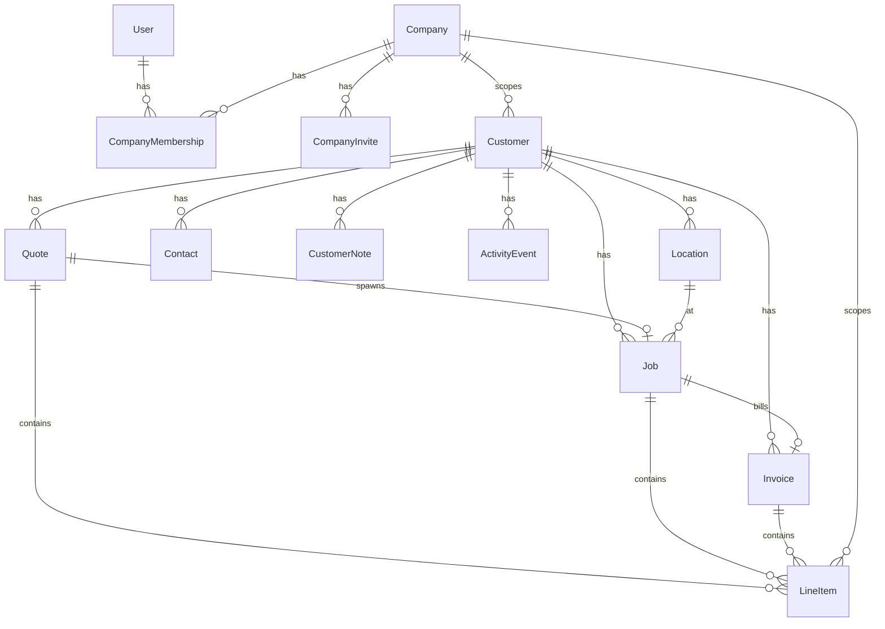

# Database Schema

Entity-relationship overview for CrewLution. All tenant data is scoped by `accounts.Company`.

> **SQL DDL:** [schema.sql](schema.sql) — PostgreSQL `CREATE TABLE` statements for the domain schema.  
> **DBML diagram:** [schema.dbml](schema.dbml) — import at [dbdiagram.io](https://dbdiagram.io).

## ER diagram

## accounts

### Company

| Field | Type | Notes |
|-------|------|-------|
| name | CharField(200) | Indexed |
| phone, website, email | contact fields | Optional |
| address1, address2, city, state, postal_code | address | Optional |
| business_hours | JSONField | Per-day open/close/closed |
| show_business_hours | BooleanField | Client hub visibility |
| is_active | BooleanField | Indexed |

### CompanyMembership

| Field | Type | Notes |
|-------|------|-------|
| company | FK → Company | CASCADE |
| user | FK → User | CASCADE |
| role | CharField | owner, admin, dispatcher, tech, viewer |
| is_active | BooleanField | Indexed |

**Constraints:** `UniqueConstraint(company, user)`

### CompanyInvite

| Field | Type | Notes |
|-------|------|-------|
| company | FK → Company | CASCADE |
| token_hash | CharField(64) | Unique; SHA-256 of raw token |
| role | CharField | Invitable roles (not owner) |
| expires_at | DateTimeField | |
| used_at, revoked_at | DateTimeField | Nullable |
| created_by, used_by | FK → User | SET_NULL |

### CustomerPortalLink

| Field | Type | Notes |
|-------|------|-------|
| company | FK → Company | CASCADE |
| customer | FK → Customer | CASCADE |
| token_hash | CharField(64) | Unique; SHA-256 of raw token |
| created_by | FK → User | SET_NULL |
| revoked_at | DateTimeField | Nullable |
| last_accessed_at | DateTimeField | Nullable |

Magic link URL: `/portal/<token>/` — read-only client view of quotes, jobs, and invoices.

## crm

All CRM models extend `TimeStampedModel` (`created_at`, `updated_at`).

### Customer

| Field | Type | Notes |
|-------|------|-------|
| company | FK → Company | CASCADE |
| kind | CharField | person or company |
| display_name | CharField | Required |
| company_name, email, phone | Optional contact info | |
| is_active | BooleanField | |

### Location

| Field | Type | Notes |
|-------|------|-------|
| company | FK → Company | CASCADE |
| customer | FK → Customer | CASCADE |
| label, address fields, country | | |
| is_primary | BooleanField | Indexed with company + customer |

### Contact

| Field | Type | Notes |
|-------|------|-------|
| company | FK → Company | CASCADE |
| customer | FK → Customer | CASCADE |
| first_name, last_name, email, phone, title | | |
| is_primary | BooleanField | |

### CustomerNote

| Field | Type | Notes |
|-------|------|-------|
| company, customer | FK | CASCADE |
| created_by | FK → User | SET_NULL |
| body | TextField | |

### ActivityEvent

| Field | Type | Notes |
|-------|------|-------|
| company, customer | FK | CASCADE |
| actor | FK → User | SET_NULL |
| verb | CharField | created/updated events |
| message | TextField | |

**Index:** `(company, customer, -created_at)`

## commerce

All commerce models extend `TimeStampedModel`.

### Quote

| Field | Type | Notes |
|-------|------|-------|
| company, customer | FK | CASCADE |
| sequence | PositiveIntegerField | Auto per company |
| title | CharField | Optional |
| status | CharField | draft, sent, accepted, declined, expired |
| total | DecimalField(12,2) | Recalculated from line items |
| currency | CharField | Default USD |
| accepted_at | DateTimeField | Nullable |

**Constraint:** `UniqueConstraint(company, sequence)`  
**Reference:** `QT-{sequence:05d}`

### Job

| Field | Type | Notes |
|-------|------|-------|
| company, customer | FK | CASCADE |
| location | FK → Location | SET_NULL, nullable |
| quote | FK → Quote | SET_NULL, nullable |
| sequence | PositiveIntegerField | Auto per company |
| title, status, total | | |
| scheduled_start, scheduled_end | DateTimeField | Nullable |
| completed_at | DateTimeField | Nullable |

**Statuses:** draft, scheduled, in_progress, completed, cancelled  
**Reference:** `JB-{sequence:05d}`

### Invoice

| Field | Type | Notes |
|-------|------|-------|
| company, customer | FK | CASCADE |
| job | FK → Job | SET_NULL, nullable |
| sequence | PositiveIntegerField | Auto per company |
| title, status, total | | |
| due_date | DateField | Nullable |
| paid_at | DateTimeField | Nullable |

**Statuses:** draft, sent, paid, void  
**Reference:** `INV-{sequence:05d}`

### LineItem

| Field | Type | Notes |
|-------|------|-------|
| company | FK → Company | CASCADE |
| quote, job, invoice | FK | CASCADE; exactly one parent in practice |
| description | CharField(300) | |
| quantity | DecimalField | Min 0.01 |
| unit_price | DecimalField | Min 0 |
| sort_order | PositiveIntegerField | |

**Computed:** `amount = quantity × unit_price`  
Parent `total` updated via `recalculate_total()` in `commerce/services/line_items.py`.

## Indexing strategy

- Company FK on all domain tables for tenant scoping
- Status fields indexed for dashboard aggregations
- `(company, scheduled_start)` on Job for schedule queries
- Unique per-company sequences on Quote, Job, Invoice
