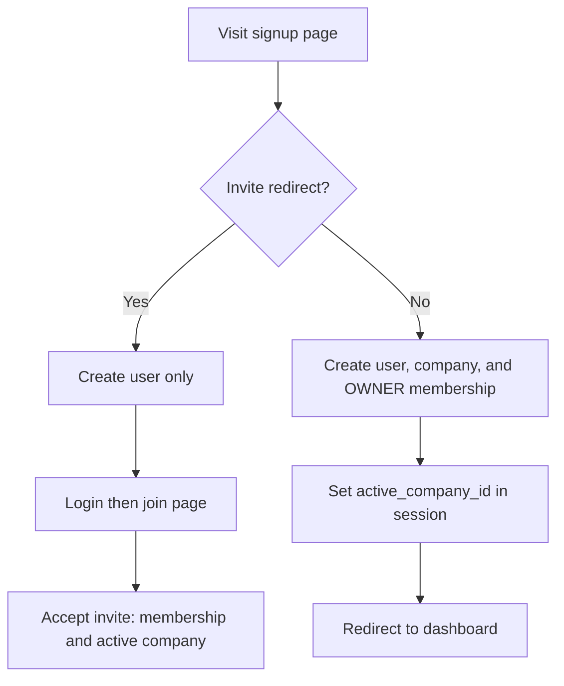
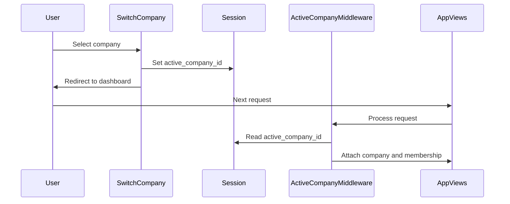
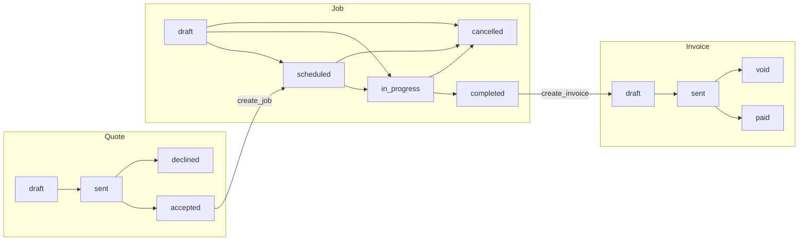
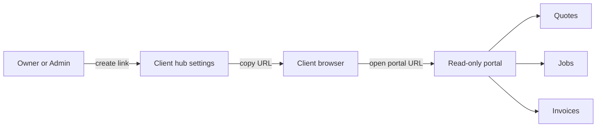

# Workflows

User journeys and state transitions in CrewLution.

## Signup & onboarding

### Join via invite (`/join/<token>/`)

1. Validate token hash against `CompanyInvite`.
2. Unauthenticated users see login/signup prompt.
3. POST accept: create `CompanyMembership` with invite role, mark invite used, set active company, redirect to dashboard.
4. Owner role cannot be assigned via invite.

## Company switching

## CRM customer lifecycle

1. **List** — `/app/crm/customers/` with search and pagination.
2. **Create/edit** — Unified `CustomerJobberForm` atomically saves customer + primary contact + primary location.
3. **Detail** — Shows contacts, locations, notes, activity timeline.
4. **Nested CRUD** — Contacts and locations under customer; global lists at `/app/crm/contacts/` and `/app/crm/locations/`.
5. **Activity** — Auto-logged via `crm.signals` on save events.

All CRM views require `@login_required` + `@company_required`.

## Commerce pipeline

### Transition triggers

| Action | Where | Service |
|--------|-------|---------|
| Accept quote | POST `action=accept` on quote detail | `transitions.accept_quote()` |
| Create job from quote | POST `action=create_job` | `transitions.create_job_from_quote()` |
| Complete job | POST `action=complete` | `transitions.mark_job_completed()` |
| Create invoice | POST `action=create_invoice` | `transitions.create_invoice_from_job()` |
| Send invoice | POST `action=send` | `transitions.mark_invoice_sent()` |
| Mark paid | POST `action=paid` | `transitions.mark_invoice_paid()` |
| Void invoice | POST `action=void` | `transitions.void_invoice()` — owner/admin only |
| Cancel job | POST `action=cancel` | `transitions.cancel_job()` — owner/admin only; from draft, scheduled, or in_progress |

### Line items

- Created/edited via inline formsets on quote/job/invoice **edit** pages.
- New records redirect to edit so line items can be added immediately.
- `copy_line_items()` runs on quote→job and job→invoice transitions.
- `recalculate_total()` sums line item amounts into parent `total`.

### Validation rules

| Transition | Requirement |
|------------|-------------|
| Accept quote | Status must be draft or sent |
| Create job | Quote must be accepted; no existing job for quote |
| Create invoice | Job must be completed; no non-void invoice for job |
| Void then re-invoice | Void existing invoice first |

## Team management

`/app/team/` (Owner/Admin only):

| Action | Behavior |
|--------|----------|
| List members | Username, email, role, active/inactive |
| Change role | Admin, Dispatcher, Tech, Viewer (not Owner) |
| Remove | Sets `is_active=False` (cannot remove owner or self) |
| Reactivate | Restores inactive members |
| Invite | Single-use join links (existing flow) |

## Client portal (magic link)

- Links created in **Settings → Client hub** (`/app/settings/client-hub/`)
- One active link per client (new link revokes previous)
- Portal shows company name, optional business hours, and scoped records
- No login required; token validated via SHA-256 hash (same pattern as team invites)

## Scheduling

| Feature | Implementation |
|---------|----------------|
| Job times | `scheduled_start`, `scheduled_end` on Job |
| Month view (default) | `/app/schedule/?view=month&month=YYYY-MM-DD` — Sun–Sat grid with padding days |
| Week view | `/app/schedule/?view=week&week=YYYY-MM-DD` — seven day columns (Sunday-first) |
| Schedule service | `commerce/services/schedule.py` — `month_schedule`, `week_schedule`, `jobs_for_range` |
| Event chips | Color by job status; label = title or customer name |
| Dashboard today | `today_appointments()` — jobs scheduled today |
| Location picker | `/app/jobs/locations/?customer=` JSON API reloads on customer change |

### Schedule UI controls

- **Today** — jumps to the current month or week
- **Previous / Next** — navigates by month or week depending on active view
- **Month / Week** — toggles view while preserving the relevant period anchor

### Planned (not yet implemented)

- Unscheduled jobs sidebar
- Drag-and-drop reschedule API
- Invoice reminder events on the calendar

## Settings

| Route | Who can edit | What |
|-------|--------------|------|
| `/app/settings/company/` | Owner, Admin | Company profile + business hours |
| `/app/settings/client-hub/` | Owner, Admin | Create and revoke client portal magic links per customer |

Team member and invite management is at `/app/team/` — see **Team management** above.

## Dashboard metrics

`commerce/services/dashboard.py` powers dashboard cards:

| Card | Function |
|------|----------|
| Workflow counts | `workflow_counts()` — quotes/jobs/invoices by status |
| Today's appointments | `today_appointments()` — scheduled jobs today |
| Business performance | `business_performance()` — receivables, upcoming jobs, revenue |
